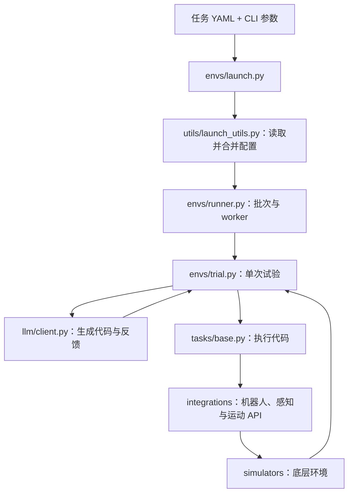
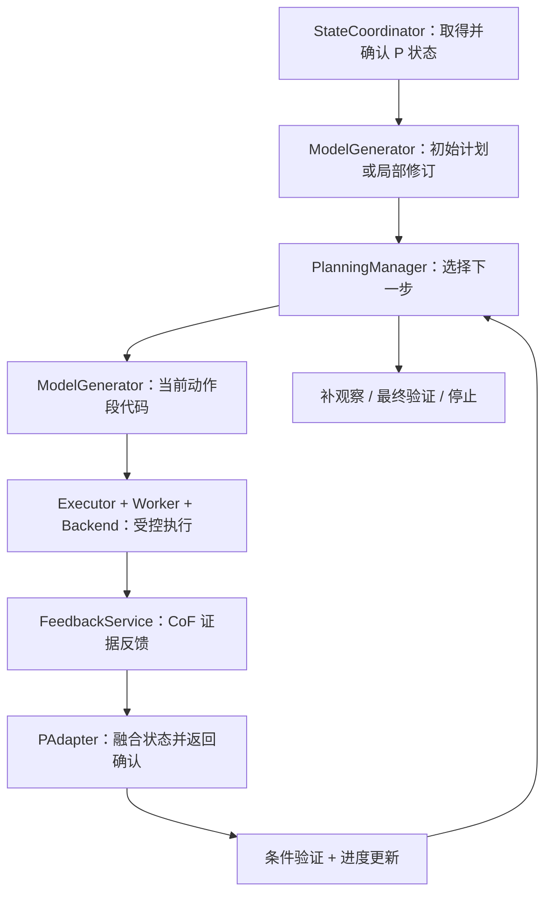

# 机器人 Coding Agent：项目代码结构说明

日期：2026-09-29 · 版本：v0.1 · 范围：当前本地代码结构与实际接入情况

本文用于了解代码放在哪里、模块之间如何调用，以及修改某项能力应该从哪个文件入手。后续实施顺序见[《后续实施路线图》](/Users/agiuser/Documents/Codex/2026-09-24/ca/outputs/robot-coding-agent-next-steps.md)。

当前项目在原 Cap-X 上新增了 stateful Agent。原有仿真评测路径继续保留；新增闭环已有独立 CLI 和合成场景测试，尚未接通实际仿真、外部 P 和原 Web UI。

## 1. 先区分工作目录、仓库与 Python 包

当前工作目录是：

```text
/Users/agiuser/Documents/Codex/2026-09-24/ca/
├── cap-x/      Git 仓库：源码、配置、测试、资源、运行说明
├── outputs/    项目开发文档及历史测试/演示结果
└── work/       编写文档时使用的辅助检查脚本
```

这里有两个容易混淆的名字：

- **cap-x** 是仓库文件夹名，也是 Git 根目录。
- **capx** 是仓库内部的 Python 包名，代码中通过 `import capx` 引用。

例如，新增 Agent 源码的完整位置是 [cap-x/capx/agents/stateful](/Users/agiuser/Documents/Codex/2026-09-24/ca/cap-x/capx/agents/stateful)。工作目录自身不是 Git 仓库，外层的开发文档不会因为提交内部仓库而自动进入 Git。

## 2. 仓库顶层各部分的作用

| 位置 | 职责 | 通常什么时候需要看 |
| --- | --- | --- |
| [capx/](/Users/agiuser/Documents/Codex/2026-09-24/ca/cap-x/capx) | Python 主代码 | 开发规划、执行、反馈、环境和服务 |
| [env_configs/](/Users/agiuser/Documents/Codex/2026-09-24/ca/cap-x/env_configs) | 按任务组织的 YAML 配置 | 选择任务、机器人、API、服务和实验参数 |
| [tests/](/Users/agiuser/Documents/Codex/2026-09-24/ca/cap-x/tests) | 环境、集成及新增 Agent 测试 | 验证行为、定位回归 |
| [docs/](/Users/agiuser/Documents/Codex/2026-09-24/ca/cap-x/docs) | 仓库内安装、运行及扩展说明 | 部署、接新环境和阅读已实现能力 |
| [scripts/](/Users/agiuser/Documents/Codex/2026-09-24/ca/cap-x/scripts) | 实验、回归、服务启动和技能整理脚本 | 批量实验和辅助操作 |
| [web-ui/](/Users/agiuser/Documents/Codex/2026-09-24/ca/cap-x/web-ui) | React + TypeScript 前端 | 修改聊天界面、执行展示和可视化面板 |
| [verl_agent_reward/](/Users/agiuser/Documents/Codex/2026-09-24/ca/cap-x/verl_agent_reward) | 强化学习使用的奖励接入代码 | 训练实验 |
| [pyproject.toml](/Users/agiuser/Documents/Codex/2026-09-24/ca/cap-x/pyproject.toml) | Python 依赖、可选环境依赖和打包配置 | 安装依赖、增加运行组件 |
| [uv.lock](/Users/agiuser/Documents/Codex/2026-09-24/ca/cap-x/uv.lock) | Python 依赖锁定文件 | 复现依赖版本 |
| [.gitmodules](/Users/agiuser/Documents/Codex/2026-09-24/ca/cap-x/.gitmodules) | 第三方 Git 子模块声明 | 获取 Robosuite、LIBERO、感知与训练依赖 |
| [README.md](/Users/agiuser/Documents/Codex/2026-09-24/ca/cap-x/README.md) | 仓库总入口 | 初次阅读与安装 |

本说明主要聚焦在线机器人 Agent；训练代码目前不在新增闭环的关键运行路径上。

## 3. 原 Cap-X：环境和评测执行路径

### 3.1 envs 里面不是只有场景文件

[capx/envs/](/Users/agiuser/Documents/Codex/2026-09-24/ca/cap-x/capx/envs)负责环境抽象、任务包装和试验运行。

| 位置 | 主要内容 |
| --- | --- |
| [launch.py](/Users/agiuser/Documents/Codex/2026-09-24/ca/cap-x/capx/envs/launch.py) | 原 CLI 入口，解析参数并选择无界面批量运行或 Web UI |
| [runner.py](/Users/agiuser/Documents/Codex/2026-09-24/ca/cap-x/capx/envs/runner.py) | 试验批次、worker、服务启动、重试、超时及汇总 |
| [trial.py](/Users/agiuser/Documents/Codex/2026-09-24/ca/cap-x/capx/envs/trial.py) | 单次试验：初始代码生成、执行、视觉反馈、多轮决策和视频记录 |
| [base.py](/Users/agiuser/Documents/Codex/2026-09-24/ca/cap-x/capx/envs/base.py) | 底层环境抽象及环境注册 |
| [simulators/](/Users/agiuser/Documents/Codex/2026-09-24/ca/cap-x/capx/envs/simulators) | Robosuite、LIBERO、BEHAVIOR 和真实 Franka 等后端封装 |
| [tasks/](/Users/agiuser/Documents/Codex/2026-09-24/ca/cap-x/capx/envs/tasks) | 面向代码生成的任务包装，包含任务提示和参考代码 |
| [adapters/](/Users/agiuser/Documents/Codex/2026-09-24/ca/cap-x/capx/envs/adapters) | Robosuite、LIBERO 等环境的接口包装 |
| [configs/](/Users/agiuser/Documents/Codex/2026-09-24/ca/cap-x/capx/envs/configs) | 配置读取及对象实例化工具 |
| [assets/](/Users/agiuser/Documents/Codex/2026-09-24/ca/cap-x/capx/envs/assets) | 机器人网格、场景 XML 和 URDF 等静态资源 |
| [scripts/](/Users/agiuser/Documents/Codex/2026-09-24/ca/cap-x/capx/envs/scripts) | 环境批量运行辅助入口 |

### 3.2 原 CLI 如何运行一个任务

以下是原无界面评测路径的主要调用关系：



关键函数是：

- `launch.main()`：调用 `_load_config()`，选择运行模式。
- `runner._run_headless_trials()`：组织顺序或并行试验。
- `trial._run_single_trial()`：执行一次任务。
- `trial._query_initial_code()`、`_handle_multi_turn_step()`：初始生成与多轮决策。

原路径已经具有多轮执行、历史代码和视觉反馈；新增框架进一步引入显式计划、经证据验证的进度、受控动作段和状态更新确认。

### 3.3 tasks、simulators 与 integrations 如何配合

以堆叠任务为例，[堆叠 YAML](/Users/agiuser/Documents/Codex/2026-09-24/ca/cap-x/env_configs/cube_stack/franka_robosuite_cube_stack.yaml)指定：

1. 任务类 `FrankaPickPlaceCodeEnv`，定义目标描述和参考代码。
2. 底层环境名 `franka_robosuite_cubes_low_level`，对应实际仿真封装。
3. 启用的 API，例如 `FrankaControlApi`。
4. 需要启动的感知/运动服务，以及录像、试验次数和 worker 数。

[tasks/base.py](/Users/agiuser/Documents/Codex/2026-09-24/ca/cap-x/capx/envs/tasks/base.py)中的 `CodeExecutionEnvBase`把底层环境和 API 组合起来，向模型提供任务与 API 文档。原 `_exec_user_code()`在保留变量的 Python namespace 中执行代码。

新框架在这里增加了 `api_functions()`，用于获取已启用的 callable 注册表；原代码执行方式仍保留。新增执行器通过这些 callable 对接环境，不需要把生成代码送入旧的 `_exec_user_code()`。

## 4. 机器人 API、模型调用和服务

### 4.1 integrations：模型代码可以调用什么

[capx/integrations/](/Users/agiuser/Documents/Codex/2026-09-24/ca/cap-x/capx/integrations)提供机器人控制、视觉感知和运动规划 API。

| 位置 | 作用 |
| --- | --- |
| [base_api.py](/Users/agiuser/Documents/Codex/2026-09-24/ca/cap-x/capx/integrations/base_api.py) | API 基类、注册及文档组织 |
| [franka/](/Users/agiuser/Documents/Codex/2026-09-24/ca/cap-x/capx/integrations/franka) | Franka 控制及任务相关 API，包含不同接口粒度与权限配置 |
| [r1pro/](/Users/agiuser/Documents/Codex/2026-09-24/ca/cap-x/capx/integrations/r1pro) | R1Pro 控制 |
| [vision/](/Users/agiuser/Documents/Codex/2026-09-24/ca/cap-x/capx/integrations/vision) | SAM、OWL-ViT、GraspNet、Molmo 等视觉工具接入 |
| [motion/](/Users/agiuser/Documents/Codex/2026-09-24/ca/cap-x/capx/integrations/motion) | PyRoKi、cuRobo 等运动规划和 IK 接入 |
| [robosuite/](/Users/agiuser/Documents/Codex/2026-09-24/ca/cap-x/capx/integrations/robosuite) | Robosuite 控制器配置 |

API 类的 `functions()`决定向生成代码暴露哪些函数，函数签名和 docstring 用于生成接口文档。增加 API 时，需同时考虑注册、任务配置，以及新增执行器中的参数校验和返回值适配。

### 4.2 模型客户端有两套，分别服务不同路径

| 位置 | 使用路径 | 职责 |
| --- | --- | --- |
| [capx/llm/client.py](/Users/agiuser/Documents/Codex/2026-09-24/ca/cap-x/capx/llm/client.py) | 原评测与 Web UI | 模型请求、流式响应及组合推理等 |
| [stateful/models/client.py](/Users/agiuser/Documents/Codex/2026-09-24/ca/cap-x/capx/agents/stateful/models/client.py) | 新增 Agent | 结构化提案调用、有限重试、超时、额度和调用记录 |

修改新增 Agent 的请求、预算或错误处理时，应从第二个文件入手，不能只改原客户端。

[capx/serving/](/Users/agiuser/Documents/Codex/2026-09-24/ca/cap-x/capx/serving)提供模型代理和感知/运动服务的启动程序，例如 OpenRouter、vLLM、SAM3、GraspNet、PyRoKi、cuRobo。客户端负责发请求，服务端负责承接请求或加载相应模型。

## 5. 新增 stateful Agent：核心源码位置

新增逻辑集中在 [capx/agents/stateful/](/Users/agiuser/Documents/Codex/2026-09-24/ca/cap-x/capx/agents/stateful)：

```text
/Users/agiuser/Documents/Codex/2026-09-24/ca/cap-x/capx/agents/stateful/
├── __main__.py    独立 CLI
├── contracts.py   任务、状态和执行等公共数据结构
├── demo.py        第一阶段固定脚本演示
├── execution/    受控执行、代码进程、后端与事件账本
├── planning/     计划、进度、条件验证和局部修订
├── models/       模型提案、调用管理和主循环
├── feedback/     CoF 证据选择、分析与校验
└── state/        P 接口、状态更新确认与派发门控
```

### 5.1 execution：一次动作如何执行并留下记录

| 文件 | 核心职责 |
| --- | --- |
| [executor.py](/Users/agiuser/Documents/Codex/2026-09-24/ca/cap-x/capx/agents/stateful/execution/executor.py) | `Executor`：检查请求、登记派发、调用 API、采样、保存报告、取消和对账 |
| [worker.py](/Users/agiuser/Documents/Codex/2026-09-24/ca/cap-x/capx/agents/stateful/execution/worker.py) | 独立代码进程、受限 AST 解释、与父进程 API 网关通信 |
| [backend.py](/Users/agiuser/Documents/Codex/2026-09-24/ca/cap-x/capx/agents/stateful/execution/backend.py) | `Backend`协议：函数目录、调用、观测、运动状态和停止接口 |
| [validation.py](/Users/agiuser/Documents/Codex/2026-09-24/ca/cap-x/capx/agents/stateful/execution/validation.py) | API 目录构建，代码、请求身份和状态有效性校验 |
| [store.py](/Users/agiuser/Documents/Codex/2026-09-24/ca/cap-x/capx/agents/stateful/execution/store.py) | `EventStore`：SQLite 事件账本、派发去重、报告和产物保存、只读回放 |
| [adapters/capx_backend.py](/Users/agiuser/Documents/Codex/2026-09-24/ca/cap-x/capx/agents/stateful/execution/adapters/capx_backend.py) | `CapXBackend`：包装已有环境的 API，接收观测与停止回调 |
| [adapters/fake_backend.py](/Users/agiuser/Documents/Codex/2026-09-24/ca/cap-x/capx/agents/stateful/execution/adapters/fake_backend.py) | 第一阶段的合成后端及故障注入 |

模型代码使用 `process`模式，子进程通过网关请求父进程执行 API。模拟器及机器人调用留在父进程原线程。固定可信演示也保留 `trusted_in_process`模式。

`ExecutionReport.completed`表示本段执行正常结束，不直接表示任务成功。实际效果仍需条件验证。代码进程结束也不等于机器人运动已停止，停止状态由后端提供。

### 5.2 planning：下一步做什么，什么时候算完成

| 文件 | 核心职责 |
| --- | --- |
| [manager.py](/Users/agiuser/Documents/Codex/2026-09-24/ca/cap-x/capx/agents/stateful/planning/manager.py) | `PlanningManager`：提交计划、选择子目标、准备动作段、接收验证、局部修订和结束任务 |
| [progress.py](/Users/agiuser/Documents/Codex/2026-09-24/ca/cap-x/capx/agents/stateful/planning/progress.py) | 从事件恢复计划和任务进度 |
| [validation.py](/Users/agiuser/Documents/Codex/2026-09-24/ca/cap-x/capx/agents/stateful/planning/validation.py) | 计划、条件、依赖和修订等结构校验 |
| [verification.py](/Users/agiuser/Documents/Codex/2026-09-24/ca/cap-x/capx/agents/stateful/planning/verification.py) | 按状态事实、来源、时间和证据检查条件，生成 pass/fail/unknown |
| [contracts.py](/Users/agiuser/Documents/Codex/2026-09-24/ca/cap-x/capx/agents/stateful/planning/contracts.py) | 计划、进度、动作段契约、决策和验证报告类型 |
| [fixtures.py](/Users/agiuser/Documents/Codex/2026-09-24/ca/cap-x/capx/agents/stateful/planning/fixtures.py)、[demo.py](/Users/agiuser/Documents/Codex/2026-09-24/ca/cap-x/capx/agents/stateful/planning/demo.py) | 固定规划器、合成堆叠后端与离线场景 |

这里的验证器读取结构化事实，不直接识别图像；视觉推断由反馈模块处理，状态融合由 P 接口处理。任务进度由管理器依据有效事件推进。

### 5.3 models：模型提出计划、代码和修订

| 文件 | 核心职责 |
| --- | --- |
| [generator.py](/Users/agiuser/Documents/Codex/2026-09-24/ca/cap-x/capx/agents/stateful/models/generator.py) | `ModelGenerator`：组织上下文，生成初始计划、局部修订和代码，并做有限修正 |
| [runner.py](/Users/agiuser/Documents/Codex/2026-09-24/ca/cap-x/capx/agents/stateful/models/runner.py) | `run_model_loop()`：根据规划决策调用生成、执行、观察、验证和修订 |
| [client.py](/Users/agiuser/Documents/Codex/2026-09-24/ca/cap-x/capx/agents/stateful/models/client.py)、[http_worker.py](/Users/agiuser/Documents/Codex/2026-09-24/ca/cap-x/capx/agents/stateful/models/http_worker.py) | 模型请求、严格解析、超时、调用预算和记录 |
| [contracts.py](/Users/agiuser/Documents/Codex/2026-09-24/ca/cap-x/capx/agents/stateful/models/contracts.py) | 模型配置、调用限额、代码提案等类型 |
| [fixtures.py](/Users/agiuser/Documents/Codex/2026-09-24/ca/cap-x/capx/agents/stateful/models/fixtures.py) | `ScriptedTransport`等预设回复，用于离线协议测试 |

`run_model_loop()`接收调用方提供的 `inputs_provider`和 `segment_validator`。当前演示使用合成几何输入和固定阶段规则；实际仿真接入时要替换这两部分。

### 5.4 feedback 与 state：执行后发生了什么

| 文件 | 核心职责 |
| --- | --- |
| [feedback/evidence.py](/Users/agiuser/Documents/Codex/2026-09-24/ca/cap-x/capx/agents/stateful/feedback/evidence.py) | 读取、校验和选择有界帧/状态证据，构建分析请求 |
| [feedback/analyzers.py](/Users/agiuser/Documents/Codex/2026-09-24/ca/cap-x/capx/agents/stateful/feedback/analyzers.py) | 结构化测量分析器 `SensorTimelineAnalyzer`及多图模型分析器 `ModelFrameAnalyzer` |
| [feedback/service.py](/Users/agiuser/Documents/Codex/2026-09-24/ca/cap-x/capx/agents/stateful/feedback/service.py) | 分析预算、候选事实校验、终态判断和反馈记录 |
| [feedback/contracts.py](/Users/agiuser/Documents/Codex/2026-09-24/ca/cap-x/capx/agents/stateful/feedback/contracts.py) | CoF 请求、反馈、查询和限额类型 |
| [feedback/demo.py](/Users/agiuser/Documents/Codex/2026-09-24/ca/cap-x/capx/agents/stateful/feedback/demo.py) | 当前完整合成闭环的组装入口和故障场景 |
| [state/provider.py](/Users/agiuser/Documents/Codex/2026-09-24/ca/cap-x/capx/agents/stateful/state/provider.py) | 外部 P 协议、本地参考融合和处理确认校验 |
| [state/coordinator.py](/Users/agiuser/Documents/Codex/2026-09-24/ca/cap-x/capx/agents/stateful/state/coordinator.py) | `StateCoordinator`：连接执行、CoF、P，并检查是否允许验证或派发后续动作 |
| [state/contracts.py](/Users/agiuser/Documents/Codex/2026-09-24/ca/cap-x/capx/agents/stateful/state/contracts.py) | P 更新请求、确认、状态处理限额 |

CoF 提供带证据的变化和候选事实；P 提供当前状态及处理确认。两者均不能直接把任务标为成功。P 未确认最新执行/反馈时，协调器会阻止后续动作和成功验证。

## 6. 新增闭环如何串起来

当前完整合成闭环从 [__main__.py](/Users/agiuser/Documents/Codex/2026-09-24/ca/cap-x/capx/agents/stateful/__main__.py)进入，再由 `feedback.demo.run_closed_loop()`组装各模块：



`run_model_loop()`承担主循环编排；`PlanningManager`管理计划与进度；`StateCoordinator`落实 CoF/P 交接和门控。因此当前代码没有独立的 `controller.py`，控制职责分布在这三处。

关键数据沿下面的顺序流转：

| 数据 | 含义 | 主要定义位置 |
| --- | --- | --- |
| `TaskSpec`、`StateView`、`Condition` | 固定任务、当前事实和条件 | 公共 [contracts.py](/Users/agiuser/Documents/Codex/2026-09-24/ca/cap-x/capx/agents/stateful/contracts.py) |
| `PlanProposal` → `TaskPlan` | 模型提案，经校验后的正式计划 | planning/contracts.py |
| `TaskProgress`、`PlannerDecision` | 当前进度及下一步决策 | planning/contracts.py |
| `Subgoal`、`SegmentContract` | 子目标要求和当前动作段边界 | planning/contracts.py |
| `CodeProposal` | 模型提出的本段代码与条件 | models/contracts.py |
| `ExecutionRequest` → `ExecutionReport` | 派发请求与实际运行报告 | 公共 contracts.py |
| `CoFRequest` → `CoFFeedback` | 证据分析请求与反馈 | feedback/contracts.py |
| `PUpdateRequest` → `PStateAck` | 状态更新及其处理确认 | state/contracts.py |
| `VerificationReport` | 条件验证结果 | planning/contracts.py |

这些模型会序列化成 JSON。运行目录中的 JSON 是实例或导出的格式定义；真正的字段校验规则在 Python 类型定义中。

设计文档中的 `SubgoalContract` 尚未作为独立类型落地；当前实现通过已接受计划中的 `Subgoal`，结合 `SegmentContract` 和 `ExecutionRequest` 传递要求。查找实际代码时应使用这些已实现的名称。

## 7. 原流程与新增框架的接入状态

| 项目 | 当前情况 |
| --- | --- |
| 原 CLI / 仿真运行 | 原 `envs/launch.py`、`runner.py`和 `trial.py`路径保留 |
| 新框架入口 | 独立使用 `python -m capx.agents.stateful` |
| 已有环境 API 复用 | 已增加 `api_functions()`及 `CapXBackend`适配接口 |
| 实际仿真组装 | 待补齐环境初始化、真实输入、谓词、采样、停止与运行入口 |
| 真实模型能力 | 调用接口已实现，当前保存的演示使用预设回复 |
| 外部 P | 协议已实现，当前使用本地参考实现 |
| Web UI | 原异步试验路径存在，尚未接新增 stateful 闭环 |
| 连续视觉与稳定窗口 | 当前调用边界采样不足以完成此类验收 |
| 经验/技能复用 | 原仓库有技能模块，新闭环的版本化复用与验证发布仍待接入 |

现有 `model-run`、`closed-loop-run`虽然可以请求真实模型服务，后端仍是合成堆叠。仅填写模型配置不能自动切换成 Robosuite。

## 8. Web UI、技能库和训练扩展

### 8.1 Web UI 分为前端和后端

- [web-ui/src/App.tsx](/Users/agiuser/Documents/Codex/2026-09-24/ca/cap-x/web-ui/src/App.tsx)：前端主界面。
- [web-ui/src/components/](/Users/agiuser/Documents/Codex/2026-09-24/ca/cap-x/web-ui/src/components)：聊天、代码块、图像、思考内容和可视化等组件。
- [web-ui/src/hooks/](/Users/agiuser/Documents/Codex/2026-09-24/ca/cap-x/web-ui/src/hooks)：WebSocket 连接及试验状态。
- [capx/web/server.py](/Users/agiuser/Documents/Codex/2026-09-24/ca/cap-x/capx/web/server.py)：FastAPI、HTTP/WebSocket 接口。
- [capx/web/session_manager.py](/Users/agiuser/Documents/Codex/2026-09-24/ca/cap-x/capx/web/session_manager.py)：会话、停止、输入注入和连接管理。
- [capx/web/async_trial_runner.py](/Users/agiuser/Documents/Codex/2026-09-24/ca/cap-x/capx/web/async_trial_runner.py)：原 Web UI 的异步试验执行逻辑。

原 Web UI 有自己的异步 runner，不是直接调用新增 `run_model_loop()`。后续接界面时，应先复用新增主循环并转换事件，避免在前端重新实现规划和验证规则。

### 8.2 原有 skills 与后续经验模块

[capx/skills/](/Users/agiuser/Documents/Codex/2026-09-24/ca/cap-x/capx/skills)已有函数抽取、技能保存、提示格式化和 namespace 注入等功能。核心是 `library.py`、`extractor.py`和 `claude_integration.py`。

原技能库的函数定义与注入方式不能直接等同于新增受限代码进程的技能执行方式。接入新框架时，需要落实固定版本、参数绑定、动作段边界和结果验证；自动候选验证与发布仍属于后续开发。

### 8.3 训练相关代码

[prepare_verl_dataset.py](/Users/agiuser/Documents/Codex/2026-09-24/ca/cap-x/capx/cli/prepare_verl_dataset.py)准备训练数据，[verl_agent_reward/](/Users/agiuser/Documents/Codex/2026-09-24/ca/cap-x/verl_agent_reward)提供奖励接入，[train_franka_grpo.sh](/Users/agiuser/Documents/Codex/2026-09-24/ca/cap-x/scripts/train_franka_grpo.sh)提供训练脚本。它们依赖相应训练环境，当前轻量闭环测试不经过这些入口。

## 9. 资源、第三方依赖与运行结果

### 9.1 assets：构建环境需要的静态文件

[envs/assets/](/Users/agiuser/Documents/Codex/2026-09-24/ca/cap-x/capx/envs/assets)中有 Franka、UR5 和 YAM 资源：

- XML：场景、关节、物理参数、材质和控制设置。
- URDF：机器人连杆、关节、质量与几何引用。
- OBJ/STL：显示外形或计算碰撞使用的三维网格。

实际加载哪些资源取决于所选环境；部分环境使用第三方包自身的资产。这些文件属于运行资源，上传项目时不能按“历史结果”统一省略。

### 9.2 third_party：外部源码依赖

[capx/third_party/](/Users/agiuser/Documents/Codex/2026-09-24/ca/cap-x/capx/third_party)由 Git 子模块管理，包含 Robosuite、LIBERO-PRO、SAM3、ContactGraspNet、cuRobo、BEHAVIOR 和 VeRL 等依赖。

本次检查中八个子模块均未初始化。当前轻量 stateful 测试可以运行，不代表这些外部环境已经安装；实际仿真部署时需要按所选环境获取对应依赖，并遵循仓库安装说明处理版本冲突。

### 9.3 outputs 和 work：文档与辅助产物

外层 [outputs/](/Users/agiuser/Documents/Codex/2026-09-24/ca/outputs)保存开发文档和四个阶段的历史产物。其中：

| 内容 | 作用 |
| --- | --- |
| 顶层 Markdown | 开发设计、总览、后续路线图、本代码结构说明 |
| 阶段 README / tests.txt / summaries.json | 交付说明、测试记录和演示汇总 |
| schemas/ | 从数据模型导出的 JSON Schema |
| demo(s)/ | 计划、执行、模型回复、CoF、P 和证据记录 |
| events.sqlite3 | 某次运行的权威事件账本 |
| events.jsonl 与其他 JSON | 事件及结果的可读导出、快照和证据索引 |

配置中的 `output_dir`也可能在仓库内或其他路径生成新的 outputs 目录。输出位置由配置和运行时工作目录决定，不应把所有同名目录当作同一份数据。

外层 [work/](/Users/agiuser/Documents/Codex/2026-09-24/ca/work)只有三个文档检查脚本，检查规划、执行和 CoF 文档的示例与引用一致性；不属于机器人运行时模块。

## 10. 测试在哪里，如何验证修改

| 位置 | 测试范围 |
| --- | --- |
| [test_execution.py](/Users/agiuser/Documents/Codex/2026-09-24/ca/cap-x/tests/stateful/test_execution.py) | 执行生命周期、报告、日志和停止等 |
| [test_planning.py](/Users/agiuser/Documents/Codex/2026-09-24/ca/cap-x/tests/stateful/test_planning.py) | 计划、依赖、进度、验证、预算与恢复 |
| [test_models.py](/Users/agiuser/Documents/Codex/2026-09-24/ca/cap-x/tests/stateful/test_models.py) | 模型请求协议、提案、修正与限额 |
| [test_worker.py](/Users/agiuser/Documents/Codex/2026-09-24/ca/cap-x/tests/stateful/test_worker.py) | 代码进程、受限解释和 API 通信 |
| [test_feedback.py](/Users/agiuser/Documents/Codex/2026-09-24/ca/cap-x/tests/stateful/test_feedback.py) | CoF 证据、引用、时序及反馈校验 |
| [test_state_pipeline.py](/Users/agiuser/Documents/Codex/2026-09-24/ca/cap-x/tests/stateful/test_state_pipeline.py) | P 确认、门控及完整合成闭环 |
| [tests/integrations/](/Users/agiuser/Documents/Codex/2026-09-24/ca/cap-x/tests/integrations) | 感知、运动与环境集成，依具体测试需要服务/硬件 |
| [test_environments.py](/Users/agiuser/Documents/Codex/2026-09-24/ca/cap-x/tests/test_environments.py)等顶层测试 | 原环境与任务验证，需要相应依赖 |

2026-09-29 已验证的 stateful 基线为 169 项通过。使用 Python 3.10–3.12 和 Pydantic 2，在仓库根目录可执行：

```bash
cd /Users/agiuser/Documents/Codex/2026-09-24/ca/cap-x
python -m unittest discover -s tests/stateful -v
```

这组测试通过程序内的 fixture 和临时目录生成数据，不依赖外层四个阶段的历史结果目录。离线演示也可以重新运行；输出目录应为空：

```bash
python -m capx.agents.stateful closed-loop-demo --scenario all --output /Users/agiuser/Documents/Codex/2026-09-24/ca/outputs/code-structure-demo
```

以上演示命令是使用示例，本次编写结构文档没有执行，也没有创建该输出目录。完整仿真和模型效果须另行实际运行验收。

## 11. 想改什么，优先看哪里

下表中的短路径位于上文已链接的对应目录内。

| 开发目标 | 优先入口 | 要一起考虑的部分 |
| --- | --- | --- |
| 修改初始计划或局部修订提示 | stateful/models/generator.py | planning/validation.py、契约、模型测试 |
| 修改子目标选择或重试/恢复规则 | stateful/planning/manager.py | progress.py、预算归属、规划测试 |
| 修改成功/失败/未知判断 | stateful/planning/verification.py | 谓词、事实来源、时效、最终目标验证 |
| 修改动作执行或代码限制 | stateful/execution/executor.py、worker.py | validation.py、后端停止和执行测试 |
| 接实际 Robosuite | execution/adapters/capx_backend.py、models/runner.py | 环境创建、输入提供器、阶段校验、观测与停止 |
| 修改 CoF 或接视觉模型 | stateful/feedback/analyzers.py、service.py | evidence.py、图像来源、反馈测试 |
| 接同事的 P | stateful/state/provider.py | contracts.py、coordinator.py、共享样例和超时 |
| 查看日志或修改回放 | stateful/execution/store.py | planning/progress.py、事件兼容性 |
| 增加机器人 API | capx/integrations/ | API 注册、YAML、网关参数和返回值适配 |
| 增加原有环境/任务 | capx/envs/simulators/、tasks/ | 注册表、env_configs、环境测试 |
| 修改试验参数 | env_configs/ | utils/launch_utils.py 的显式配置传递 |
| 增加新框架 CLI 选项 | stateful/__main__.py | 对应配置模型和组装入口 |
| 显示新计划、进度和 CoF | capx/web/、web-ui/src/ | 先接新增事件及主循环，再实现展示 |
| 接技能复用 | capx/skills/与 stateful 生成/执行入口 | 参数绑定、版本、独立验证和对照实验 |

新增 YAML 字段时，要检查配置加载器和调用方是否实际传递；只写配置键不会自动改变程序行为。

## 12. 推荐阅读顺序与上传范围

第一次读代码，建议依次查看：

1. [新增 CLI](/Users/agiuser/Documents/Codex/2026-09-24/ca/cap-x/capx/agents/stateful/__main__.py)：了解可运行入口。
2. [完整合成闭环组装](/Users/agiuser/Documents/Codex/2026-09-24/ca/cap-x/capx/agents/stateful/feedback/demo.py)：了解模块如何创建和连接。
3. [模型主循环](/Users/agiuser/Documents/Codex/2026-09-24/ca/cap-x/capx/agents/stateful/models/runner.py)：了解一次任务如何推进。
4. [规划管理器](/Users/agiuser/Documents/Codex/2026-09-24/ca/cap-x/capx/agents/stateful/planning/manager.py)、[状态协调器](/Users/agiuser/Documents/Codex/2026-09-24/ca/cap-x/capx/agents/stateful/state/coordinator.py)：了解决策、进度和门控。
5. [执行器](/Users/agiuser/Documents/Codex/2026-09-24/ca/cap-x/capx/agents/stateful/execution/executor.py)、[P 接口](/Users/agiuser/Documents/Codex/2026-09-24/ca/cap-x/capx/agents/stateful/state/provider.py)：了解执行与状态的边界。
6. [完整闭环测试](/Users/agiuser/Documents/Codex/2026-09-24/ca/cap-x/tests/stateful/test_state_pipeline.py)：查看正常、失败和未知情况下的预期行为。
7. 准备实际仿真时，再读 [原单次试验](/Users/agiuser/Documents/Codex/2026-09-24/ca/cap-x/capx/envs/trial.py)、[环境任务基类](/Users/agiuser/Documents/Codex/2026-09-24/ca/cap-x/capx/envs/tasks/base.py)和 [Cap-X 适配器](/Users/agiuser/Documents/Codex/2026-09-24/ca/cap-x/capx/agents/stateful/execution/adapters/capx_backend.py)。

上传给协作者继续开发时，保留完整仓库源码、配置、测试、运行文档与所需资源，并附上外层开发文档。四个历史阶段结果目录可以不上传，代价是无法直接查看原来的演示轨迹；外层 work 脚本也不是运行时依赖。

当前新增框架含未提交文件，打包应包含实际工作区；仅导出旧提交会遗漏新增 Agent。第三方子模块需由接收方按安装说明获取，或在部署包中另行准备。文档链接使用当前机器的绝对路径，迁移到其他位置后需按新根目录解析。

相关入口：[开发总览](/Users/agiuser/Documents/Codex/2026-09-24/ca/outputs/robot-coding-agent-development-guide.md) · [后续实施路线图](/Users/agiuser/Documents/Codex/2026-09-24/ca/outputs/robot-coding-agent-next-steps.md) · [当前闭环运行说明](/Users/agiuser/Documents/Codex/2026-09-24/ca/cap-x/docs/stateful-closed-loop.md)。
